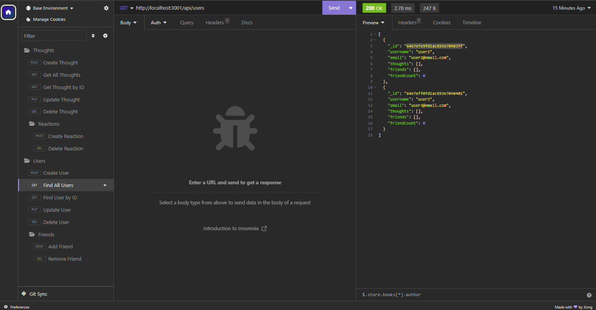

# The-Media-Is-Social
  

## Description

This is a backend application for an social network site. Wrote full backend that stores users, friends, thoughts, and reactions. One can create, get all, get by id, update, and delete for users and thoughts. Users can create and delete reactions as well as add and remove friends.

Tech used:

* Express.js
* Mongoose
* MongoDB

## Table of Contents
* [Installation](#installation)
* [Usage](#usage)
* [License](#license)
* [Display](#display)
* [Contributors](#contributors)
* [Tests](#tests)
* [Questions](#questions)

## Installation
npm i

## Usage
Visit the link below and to see a tutorial of how the backend works.

[Video Demo](https://drive.google.com/file/d/1S5ivmmYiearHX71ditQP-aSU_v2-pkDT/view?usp=sharing)

## License
For more information on this license, please visit https://mit-license.org/

## Display

## Contributors
N/A

## Tests
N/A

## Questions
rdheadyii@gmail.com

https://github.com/rdheadyii
